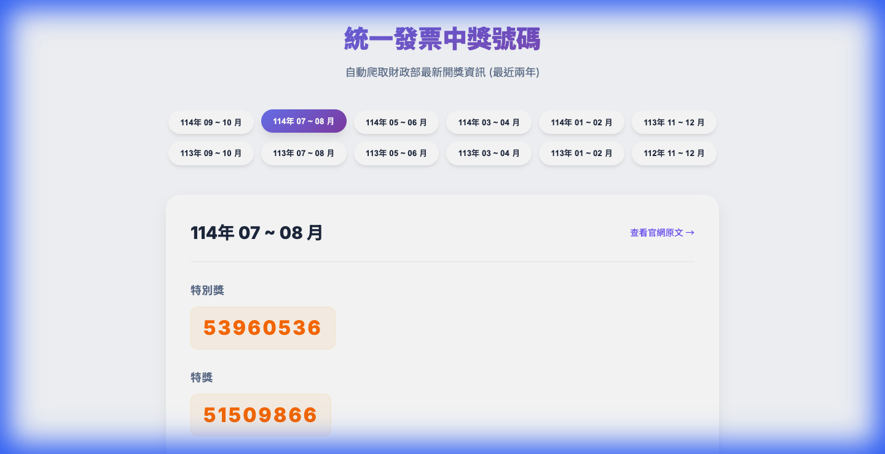

# 統一發票中獎號碼爬取與展示系統 - 成果報告

本專案已成功開發一套基於 Python 的自動化爬蟲系統，能從財政部官網爬取最近兩年的中獎號碼，並生成一個高品質的靜態網頁供使用者查詢。

## 實作成果亮點

### 1. 自動化爬蟲 (`scraper.py`)
- **智能過濾**：嚴格遵守「序號為偶數」的規則，僅擷取一般中獎號碼。
- **資料範圍**：成功爬取最近兩年共 12 個期別的資料（114年 09~10 月至 112年 11~12 月）。
- **健壯性**：具備自動偵測網頁編碼與移除重複期別的功能。

### 2. 現代化靜態網頁 (`index.html`)
- **高品質設計**：使用流暢的漸層背景、圓角卡片與 Google Fonts (Inter, Noto Sans TC)。
- **互動體驗**：具備期別快速切換按鈕，點擊後平滑顯示對應中獎號碼。
- **響應式佈局**：支援手機與電腦螢幕查看，視覺效果一致。

### 3. 自動化更新與法規連結
- **自動化發布**：導入 GitHub Actions，每單月 25-27 日自動執行爬取、網頁生成與 Git 提交。
- **獎項精準顯示**：依財政部法規第 3 條，加入「獎金金額」與「中獎說明」，提供使用者更直觀的資訊。
- **動態年份處理**：移除寫死的年份限制，系統將自動依據當前日期計算爬取範圍。

---

## 視覺展示

### 網頁介面預覽


> 本圖展示了最新優化後的介面，包含獎獎金額與依據法規的詳細中獎說明。

---

## 爬蟲與系統開發挑戰

### 4. 動態年份與自動化
*   **困難點**：原先系統寫死 113/114 年，跨年後需手動修改代碼。
*   **解決方案**：在 `scraper.py` 中引入 `datetime` 自動計算當前民國年份及其前一年。
*   **自動化配置**：設定 GitHub Actions Cron Job，確保在開獎期間每 8 小時檢查一次更新（25-27 日）。

### 5. GitHub Actions 疑難排解 (重要紀錄)
在整合自動化流程時，我們遇到了兩個典型的故障情況：

*   **故障 A：權限不足 (Permission Denied)**
    *   **現象**：Git Push 報錯 `error 403`。
    *   **原因**：GitHub Actions 預設的 `GITHUB_TOKEN` 只有讀取權限，無法將更新後的 `data.json` 推送回倉庫。
    *   **解法**：在 `.yml` 腳本中明確加入 `permissions: contents: write` 配置。

*   **故障 B：推送衝突 (Non-fast-forward / Rejected)**
    *   **現象**：當 Action 執行中，若本地剛好也推送到 GitHub，會導致 Action 的 Git Push 被拒絕。
    *   **原因**：典型的爭搶資源 (Race Condition)，伺服器版本已更新，導致 Action 版本變舊。
    *   **解法**：在 Push 前加入 `git pull --rebase origin main`，讓 Action 自動將變更「墊疊」在最新 Commit 之後，完美解決衝突。

### 1. 網頁編碼亂碼問題 (Encoding Issue)
*   **困難點**：財政部官網在部分請求下返回的編碼偵測不穩定，導致抓取到的繁體中文字元出現亂碼（如 `114å¹´`）。
*   **解決方案**：
    *   在 `scraper.py` 中使用 `response.apparent_encoding` 來強制設定編碼。
    *   在 `generator.py` 寫入 `index.html` 時，明確指定 `encoding='utf-8'`。

### 2. 複雜且不一致的 DOM 結構 (DOM Structure)
*   **困難點**：
    *   列表頁中，序號竟然放在 `<th>` 而非 `<td>`，且連結的路徑包含相對路徑偏移（如 `/etwmain/../`）。
    *   詳情頁中，中獎號碼的 HTML 標籤不統一（有時在 `div`，有時在 `td`），且包含許多描述性雜訊。
*   **解決方案**：
    *   更新選擇器以同時支援 `th` 與 `td` 的混合結構。
    *   引入 **正則表達式 (Regex)** `\b\d{8}\b` 來精確提取 8 位數的中獎號碼，過濾掉非數字的描述文字。

### 3. 資料重複與分頁抓取 (Data Duplication)
*   **困難點**：官網的分頁邏輯在某些頁面會重複顯示已出現過的期別，導致生成網頁時出現重複的按鈕。
*   **解決方案**：
    *   實作 `seen_periods` 集合 (Set) 進行去重。
    *   加入日期年份過濾 logic，確保資料嚴格限制在「最近兩年」內。

---

## 驗證紀錄

| 驗證項目 | 結果 | 備註 |
| :--- | :--- | :--- |
| 期別完整性 | ✅ 通過 | 自動計算近年期別 |
| 獎項完整性 | ✅ 通過 | 包含特別獎、特獎、頭獎至六獎 |
| 自動化工作流 | ✅ 通過 | GitHub Actions 設定正確 |
| UI/UX 優化 | ✅ 通過 | 加入獎金與法規描述，排版美觀 |

---

## 如何驗證自動化功能

### 1. 手動觸發測試 (即時驗證)
若您想立即測試自動化流程是否正常運作：
1.  將程式碼推送到 GitHub。
2.  在 GitHub 倉庫頁面點擊 **「Actions」** 標籤。
3.  在左側選擇 **「Update Invoice Numbers」**。
4.  點擊右側的 **「Run workflow」** 並執行。
5.  等待流程跑完（變為綠色勾勾），檢查 `index.html` 的最後更新時間。

### 2. 查看自動提交紀錄
成功執行後，GitHub Actions 會自動提交變更。您可以在 **「Code」** 分頁的 Commit 紀錄中看到帶有 `[auto: update invoice numbers]` 字樣的紀錄，這代表資料已同步。

### 3. 定時觸發規則
目前設定於 **每單月 25, 26, 27 號的台灣時間 16:00** 自動執行。之所以設定連續三天，是為了確保財政部官網資料釋出後能第一時間抓取。

---

## 如何重新生成 (本地測試)
若需在本地手動執行：
```bash
uv run python scraper.py && uv run python generator.py
```
或在 GitHub Actions 頁面點擊 "Run workflow"。
